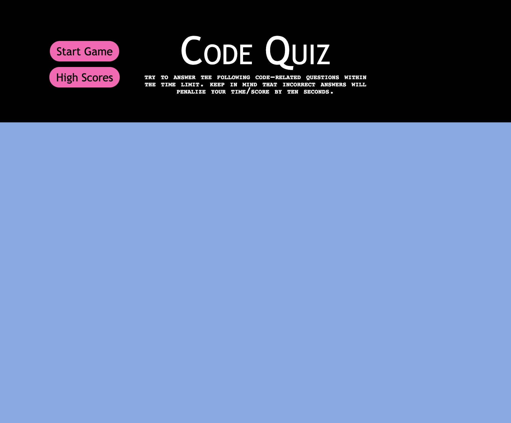
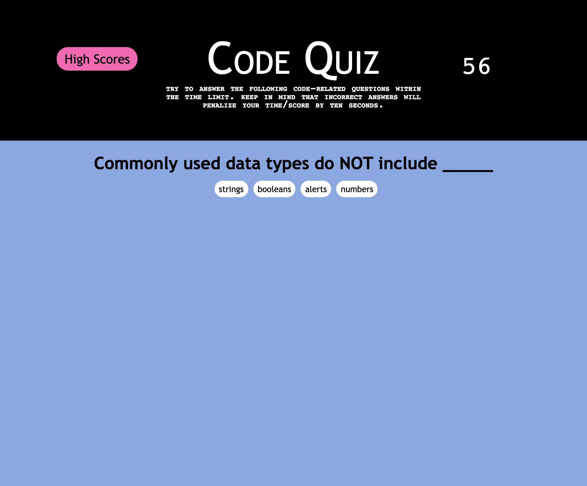
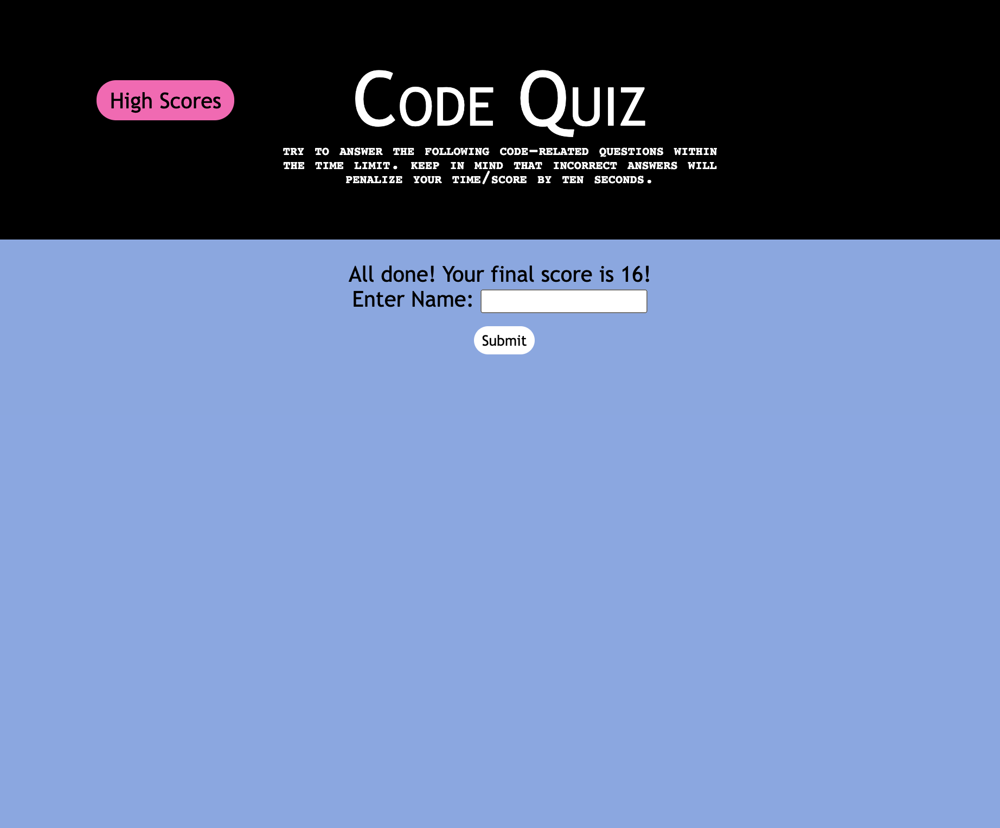

# code-quiz

This code quiz allows the user to test their coding knowledge as well as compete with others by answering multiple choice code-related questions. The user will be working against the clock by answering these questions as quickly as possible and will be docked 10 points if they click an incorrect answer.

At the end of the quiz, the user can enter their name to save their score, which is equivalent to the time remaining.

**Link to Webpage**

https://mkimborowicz.github.io/code-quiz/

**Screenshots of Webpage**

